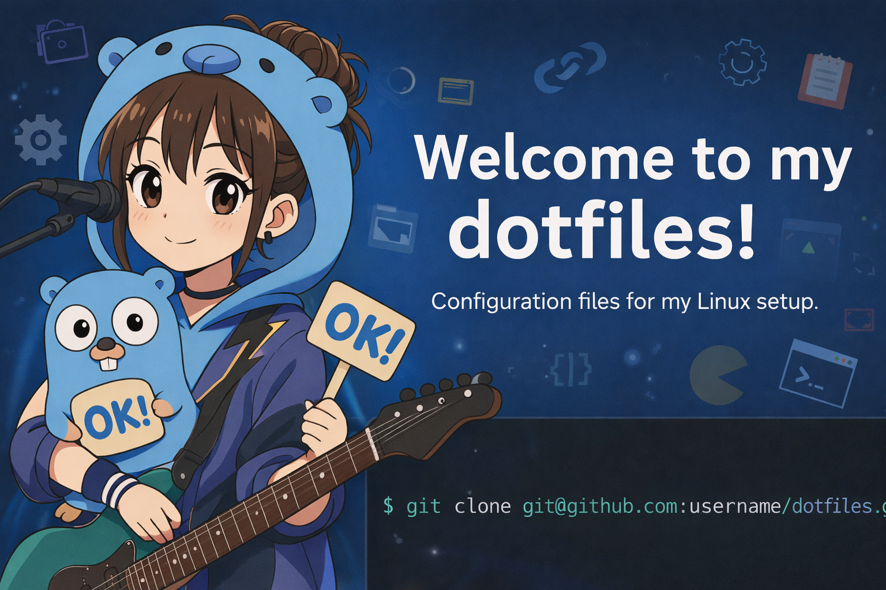

# dotfiles



o-ga09's personal dotfiles — managed as symlinks via `install.sh`.

## Structure

```
dotfiles/
├── .bashrc            # Bash config (aliases, PS1, etc.)
├── .bash_profile      # Bash login shell (PATH exports)
├── .zshrc             # Zsh config
├── .config/
│   ├── nvim/          # Neovim (LazyVim-based)
│   ├── ghostty/       # Ghostty terminal emulator
│   ├── lazygit/       # Lazygit TUI git client
│   └── starship.toml  # Starship prompt
└── install.sh         # Symlink installer
```

## Requirements

| Tool                                                             | Install                        |
| ---------------------------------------------------------------- | ------------------------------ |
| [Starship](https://starship.rs/)                                 | `brew install starship`        |
| [Neovim](https://neovim.io/) `>= 0.9`                            | `brew install neovim`          |
| [Ghostty](https://ghostty.org/)                                  | <https://ghostty.org/download> |
| [Lazygit](https://github.com/jesseduffield/lazygit)              | `brew install lazygit`         |
| [delta](https://github.com/dandavison/delta) (for lazygit pager) | `brew install git-delta`       |

## Install

```bash
git clone https://github.com/<your-username>/dotfiles.git ~/dotfiles
cd ~/dotfiles
./install.sh
```

`install.sh` creates symlinks from `~` / `~/.config/` to the files in this repo.  
Existing files are automatically backed up with a `.bak` suffix.

## Neovim

Based on [LazyVim](https://www.lazyvim.org/) starter.

**Enabled extras:**

- Languages: Go, TypeScript, Markdown, JSON, YAML, SQL, Terraform, Docker, Tailwind
- Formatting: Prettier, ESLint
- AI: GitHub Copilot, Copilot Chat

**Custom plugins:**

| Plugin                        | Purpose                            |
| ----------------------------- | ---------------------------------- |
| `xiyaowong/transparent.nvim`  | Background transparency            |
| `HakonHarnes/img-clip.nvim`   | Paste images from clipboard        |
| `folke/snacks.nvim` (lazygit) | Lazygit integration (`<leader>gg`) |

## Ghostty

Key customizations:

- Theme: `Tomorrow Night`
- Background opacity: 80% with blur
- Pane navigation: `Ctrl+h/j/k/l`
- Pane splitting: `Ctrl+Shift+v` (vertical) / `Ctrl+Shift+h` (horizontal)
- `macos-option-as-alt = true` — enables `<A-x>` keybinds in Neovim

## Lazygit

- Pager: `delta`
- Editor: `nvim`
- Nerd Fonts v3
